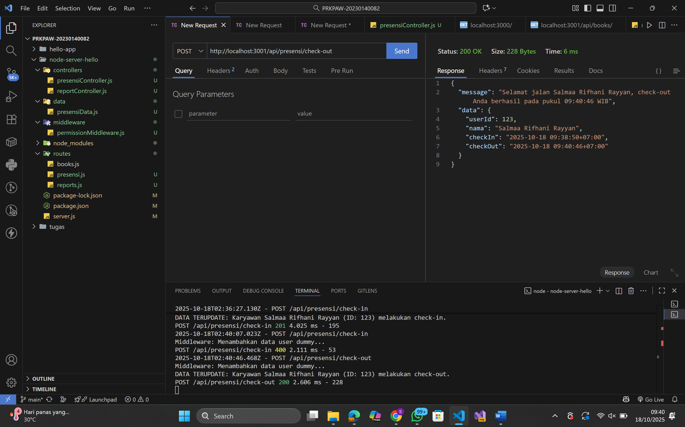

# Tugas 3

Tampilan endpoint presensi/check-in:

Tampilan endpoint presensi/check-in lebih dari 1 kali:

Tampilan endpoint presensi/check-out:

Tampilan endpoint presensi/check-out belum melakukan check-in:

Tampilan endpoint reports/daily:
