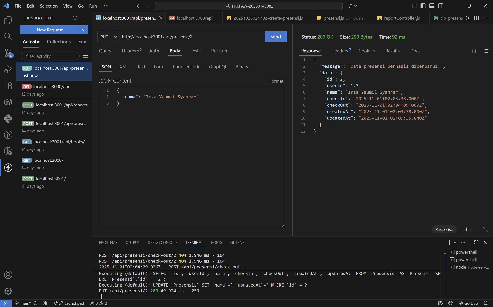
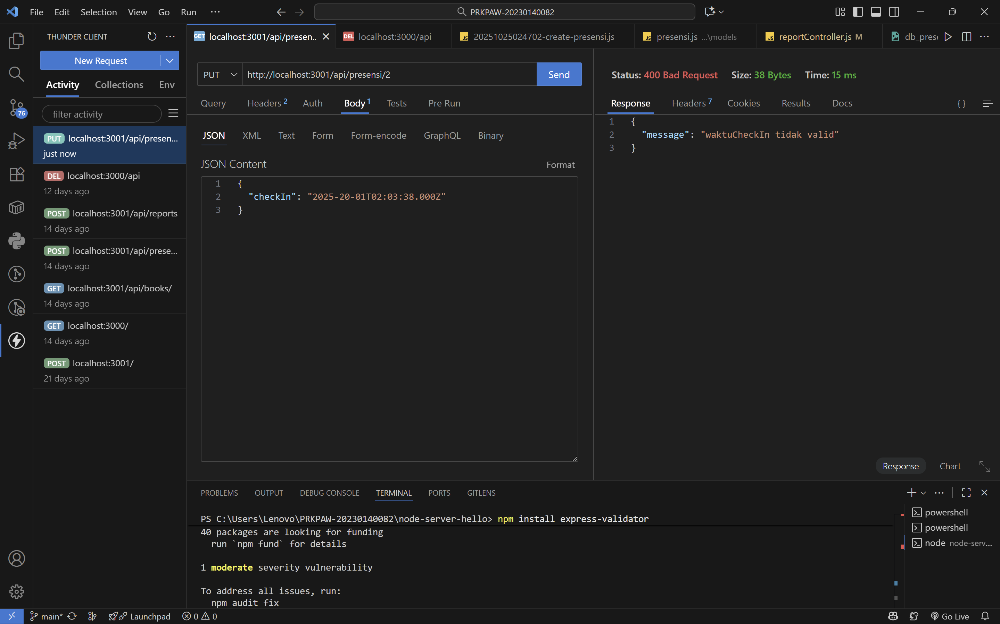
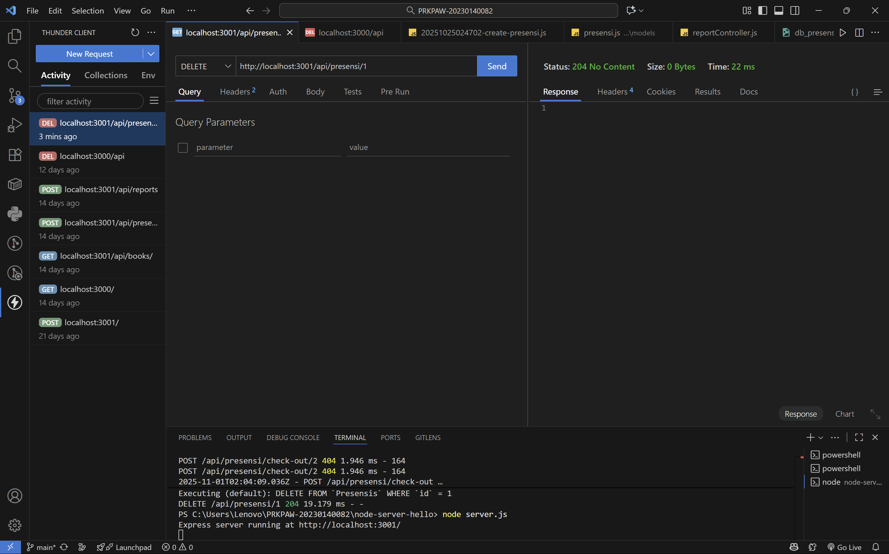
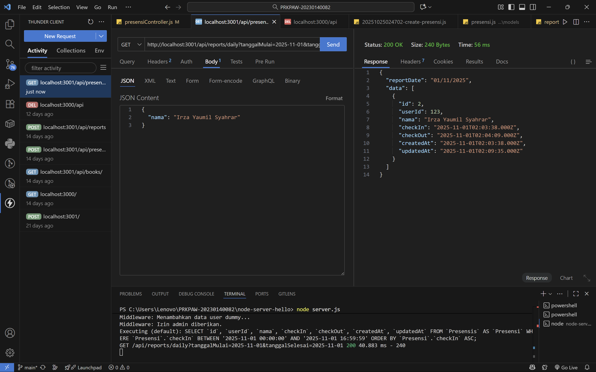

# Tugas 5

Tampilan Endpoint update data presensi:

Tampilan Endpoint update jika format tanggal yang diisi tidak valid:

Tampilan Endpoint delete data:

Tampilan Enpoint search berdasarkan nama:

Tampilan Enpoint search berdasarkan tanggal:
